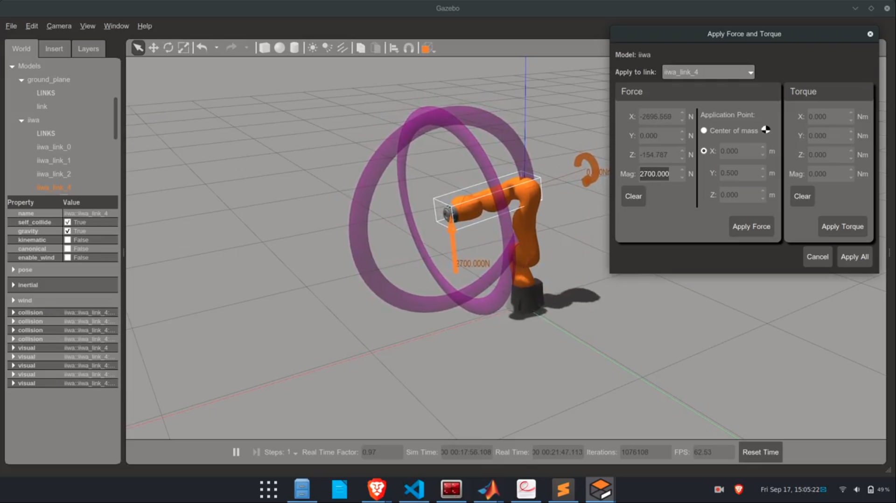

# GenCRA3S

ROS integrated MATLAB-Simulink package for the KUKA IIWA LBR7 manipulator in Gazebo environment

## Description
In this work, classical, optimal, and force-based controllers are designed for a 3 DOF spherical manipulator in Matlab-Simulink. The controllers are deployed and verified on the KUKA IIWA LBR7 industrial manipulator in ROS-Gazebo simulator using the ros_controls package.
Some intreseting results are seen in the comparison of these controllers for the robotic manipulator.

Controllers:
- Proportional Integral Derivative (PID)
- Linear Quadratic Regulator (LQR)
- Impedence Control

## How to use 

Install the requirements
Required Packages :
- Matlab
  - ROS Toolbox
  - Control Systems Toolbox
- ROS
  - ros_controls Package

Use:
- Create a workspace folder "work_space"
- Create a "src" folder inside the "work_space" folder
- Clone the repository inside the "src" folder
  - cd work_space/src 
  - git clone https://github.com/offjangir/GenCRA3S/  
- Build ros packages
  - catkin_build
- Open the MATLAB & Simulink Model files
- Start the controller launching the "PID_arm.launch" file using "roslaunch" command for PID, and "LQR_IMP_arm.launch" for LQR and Impedence controllers respectively 
- Run Parameter scripts for respective controllers in MATLAB
- Run Simulink Model

## Contributing
- Fork this repository.
- Clone the fork.
- Make a new branch and make your modifications.
- Commit and push your changes.
- Create pull request.

## Contact
- Yash Jangir  
- Prathamesh Saraf  

