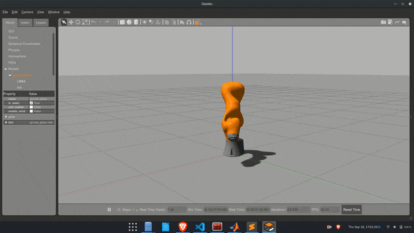

# Kuka_CS3
The code structure is designed to simulate a 3-DOF arm in Gazebo using matlab controllers backed up by PID controllers of ROS_Gazebo.

Ros Integrated Matalab & Simulink Package for  3-DOF manipulator simulation in Gazebo

## Description
In this work, Classical and Optimal controllers namely :
- PID
- LQR
- Impedence
Are desigened for a 3 DOF spherical workspace Arm in Simulink and Matlab, are deployed and simulated through ros_controls package on KUKA IIWA LBR7 in Gazebo simulator.
Some intreseting results are seen in the comparison of these controllers for such a robotic manipulator.

Some intresting Results:
Results will be soon published in a research article.

## How to use 

Install the requirements
Required Packages :
- Matlab
  - ROS Toolbox
  - Control Systems Toolbox
- ROS
  - ros_controls Package

Use:
- Clone in catkin workspace
- Build ros packages
- Open matlab & Simulink Model
- Launch Arm Control by PID_arm.launch for PID and LQR_IMP_arm.launch for LQR and Impedence 
- Run Parameter scripts for respective controllers in Matlab
- Run Simulink Model

## Contributing
- Fork this repository.
- Clone the fork.
- Make a new branch and make your modifications.
- Commit and push your changes.
- Create pull request.

## Contact
- Yash Jangir  

